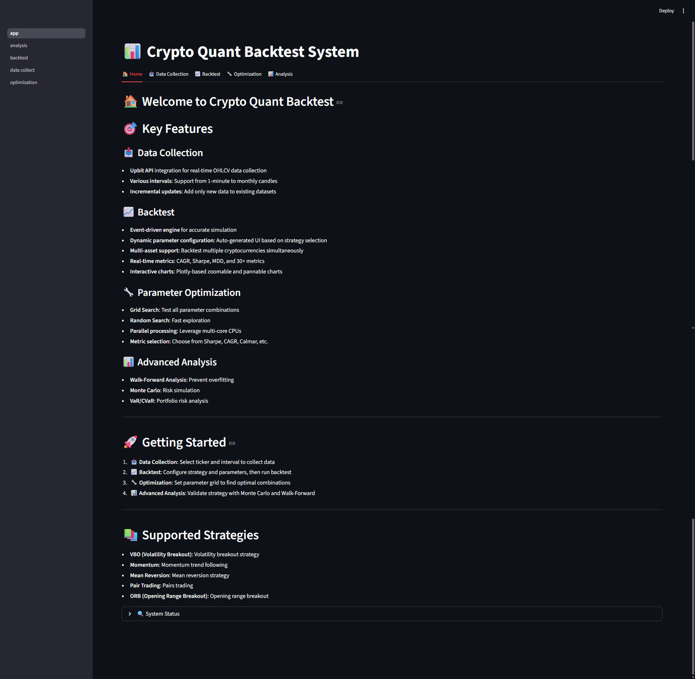
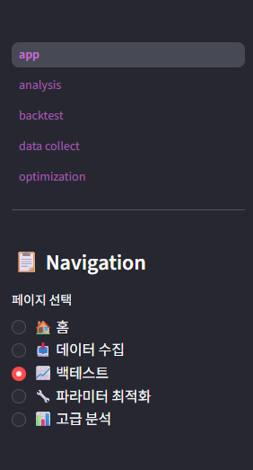
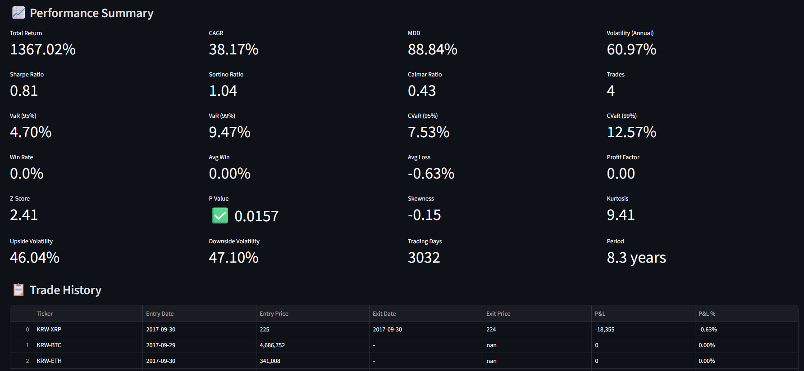
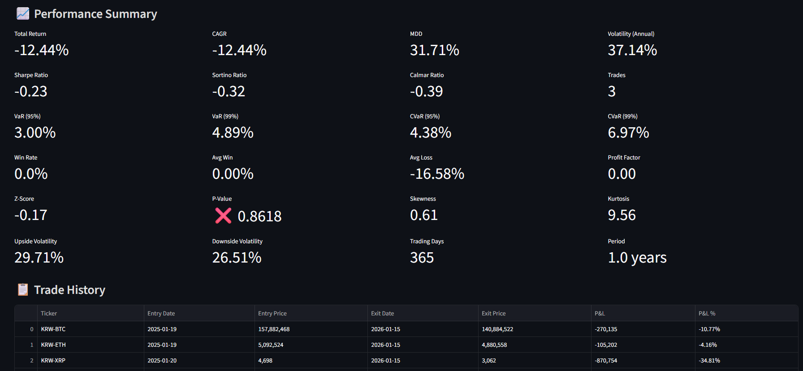
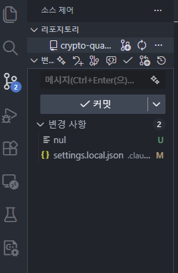
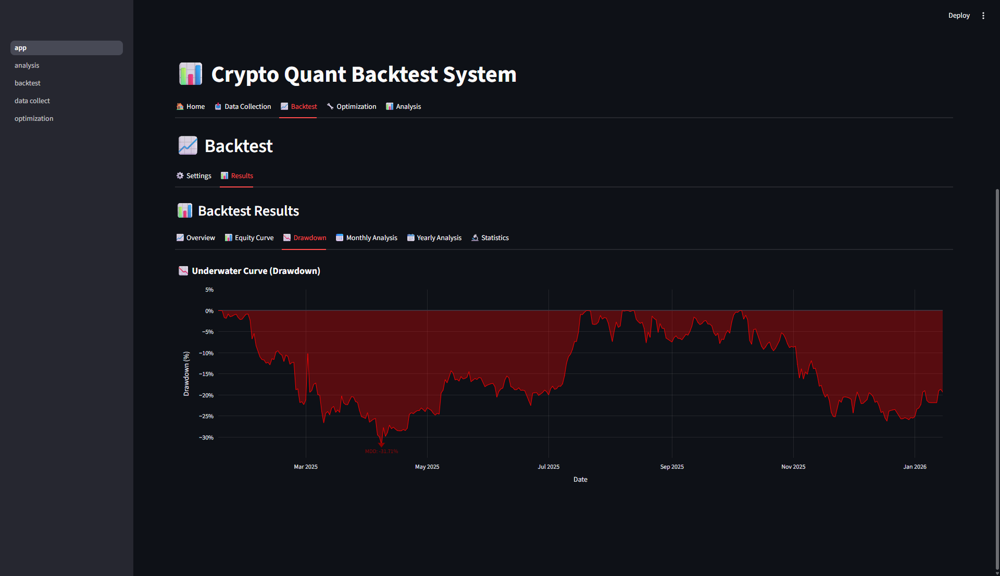
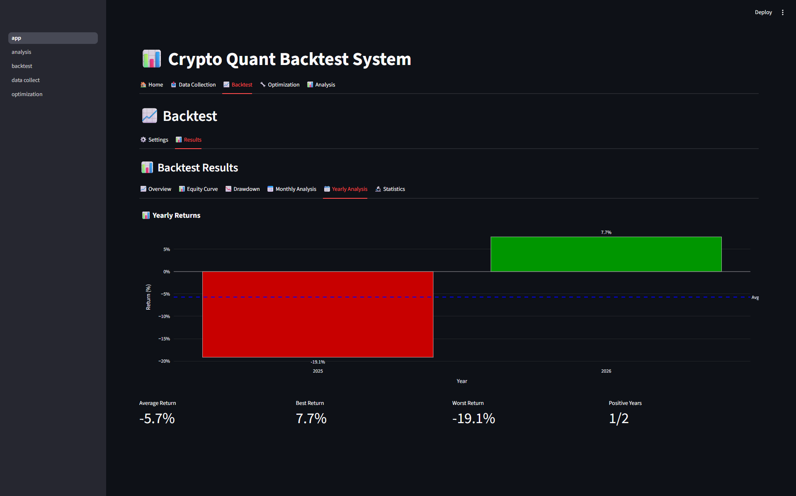
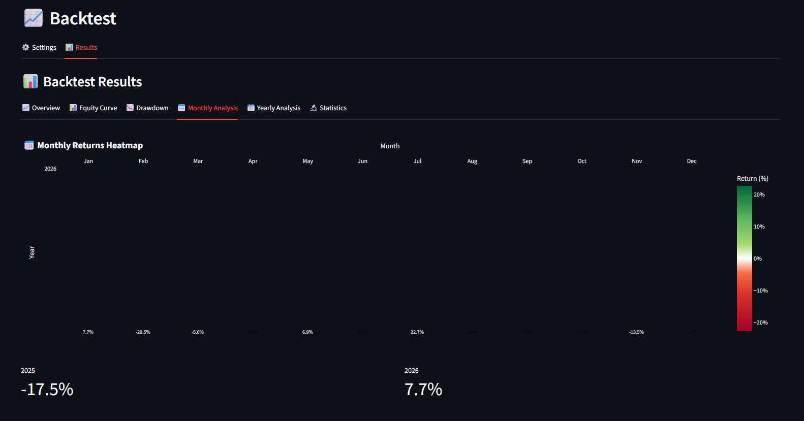
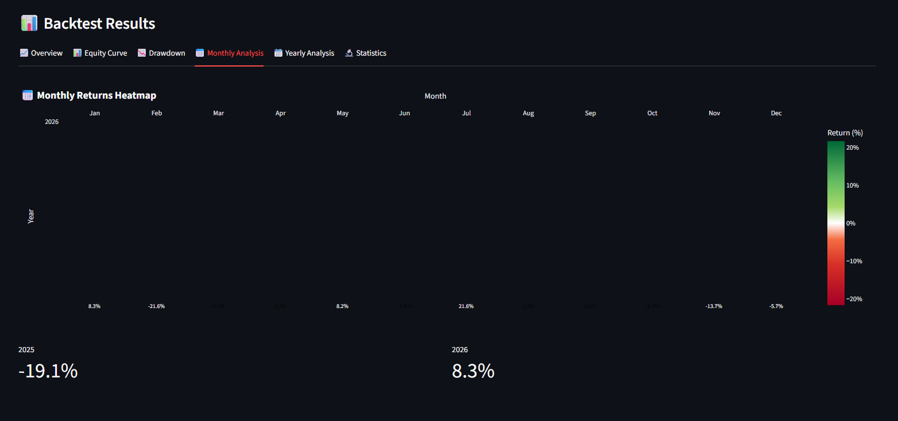
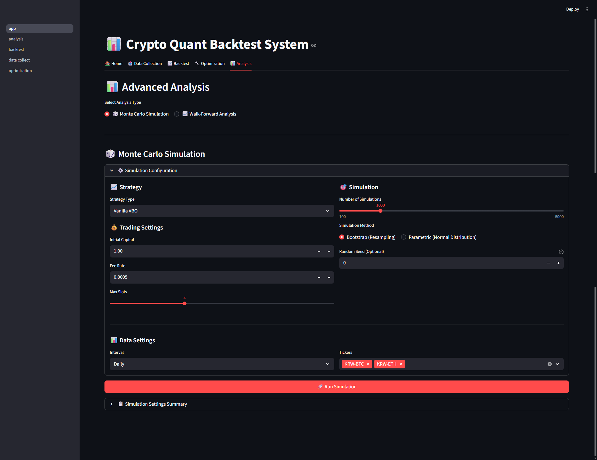

# Crypto Quant System

A production-grade automated cryptocurrency trading system with advanced backtesting, portfolio optimization, and live trading capabilities.

[](https://www.python.org/downloads/)
[](https://opensource.org/licenses/MIT)
[](http://mypy-lang.org/)
[](https://github.com/astral-sh/ruff)

## Overview

Crypto Quant System is an enterprise-level quantitative trading platform designed for cryptocurrency markets. The system provides:

- **Event-Driven Backtesting Engine**: High-accuracy simulation with realistic trade cost modeling
- **Interactive Web UI**: Streamlit-based dashboard for strategy analysis and optimization
- **Live Trading Bot**: Production-ready automated trading with real-time order execution
- **Advanced Analytics**: Walk-Forward Analysis, Monte Carlo simulation, and permutation testing
- **Portfolio Optimization**: Modern Portfolio Theory, Risk Parity, and Kelly Criterion
- **Multi-Strategy Support**: Volatility Breakout, Mean Reversion, Momentum, and Opening Range Breakout

The system supports 100+ cryptocurrency pairs via Upbit exchange with comprehensive risk management and position sizing strategies.

## 🚀 Quick Start

### Installation

```bash
# Clone the repository
git clone https://github.com/your-org/crypto-quant-system.git
cd crypto-quant-system

# Install with uv (recommended)
uv sync

# Or install with pip
pip install -e .
```

### Web UI (Recommended)

```bash
# Install web dependencies
uv sync --extra web

# Development mode (hot reload)
uv run streamlit run src/web/app.py --server.runOnSave true

# Production mode
uv run streamlit run src/web/app.py --server.port 8501 --server.headless true
```

### Command-Line Backtesting

```python
from src.backtester.engine import EventDrivenBacktestEngine
from src.backtester.models import BacktestConfig
from src.strategies.volatility_breakout import VanillaVBO

# Configure backtest
config = BacktestConfig(
    initial_capital=10_000_000,
    fee_rate=0.0005,
    slippage_rate=0.0005,
)

# Initialize strategy
strategy = VanillaVBO(sma_period=4, trend_sma_period=8)

# Run backtest
engine = EventDrivenBacktestEngine(config)
result = engine.run(strategy, data_files)
print(result.performance_metrics)
```

### Data Collection

```bash
# Collect historical data
uv run python scripts/collect_30min_data.py

# Or use the web UI data collection page
```

## 📸 Visual Overview

### Web Interface Screenshots

#### 🏠 Home Dashboard

*System overview with quick access to all features, supported strategies, and system status*

#### 📊 Data Collection Interface

*Interactive data collection for 100+ cryptocurrency pairs with flexible time intervals (1min to monthly)*

#### ⚙️ Backtest Configuration

*Comprehensive backtest configuration with strategy selection, parameter tuning, and trading costs*

#### 📈 Backtest Results - Performance Overview

*Detailed performance metrics including CAGR, Sharpe ratio, drawdown, and 30+ statistical measures*

#### 📊 Interactive Equity Curve

*Interactive portfolio value chart with time range selector and detailed hover information*

#### 📉 Drawdown Analysis

*Underwater curve visualization showing drawdown periods and maximum drawdown points*

#### 📅 Monthly Returns Heatmap

*Color-coded monthly performance heatmap with compounded yearly returns*

#### 📊 Yearly Performance

*Bar chart showing year-over-year returns with average performance line*

#### 📊 Statistical Analysis

*Statistical significance testing with Z-Score, P-Value, Skewness, and Kurtosis analysis*

#### 🔧 Parameter Optimization

*Grid search and random search for parameter optimization with parallel processing*

## 🎯 Key Features

### 📊 Trading Strategies

- **Volatility Breakout (VBO)**: Entry on breakout above volatility-adjusted target, exit on trend reversal
  - Variants: VanillaVBO, MinimalVBO, StrictVBO
  - Modular conditions: trend filters, noise filters, market filters
- **Mean Reversion**: Reverting to long-term moving averages
- **Momentum**: Trend-following strategies with dynamic entry/exit
- **Opening Range Breakout (ORB)**: 30-minute range breakout strategy

All strategies use composable `Condition` objects for flexible signal generation.

### 🔬 Backtesting Engine

#### Event-Driven Engine (Primary)
- Bar-by-bar event simulation for debugging clarity
- Accurate trade cost modeling (fees, slippage)
- Advanced order types: Stop-Loss, Take-Profit, Trailing-Stop
- 7 position sizing methods: Equal, Volatility, Fixed-Risk, Kelly, MPT, Risk-Parity
- Multi-asset portfolio backtesting

#### Vectorized Engine
- High-performance NumPy-based computation
- Suitable for parameter optimization sweeps

**Performance Metrics (30+)**:
- Risk-Adjusted Returns: CAGR, Sharpe, Sortino, Calmar ratios
- Drawdown Analysis: Max Drawdown (MDD), Average Drawdown
- Risk Metrics: VaR, CVaR (Conditional Value at Risk)
- Statistical Tests: Win rate, profit factor, expectancy

### 🎨 Interactive Web UI

Built with Streamlit and Plotly for real-time analysis:

- **Home Dashboard**: System overview and status
- **Data Collection**: Download and manage OHLCV data for 100+ crypto pairs
- **Backtesting**: Interactive parameter tuning with instant results
- **Optimization**: Grid Search and Random Search for parameter optimization
- **Advanced Analysis**: Walk-Forward, Monte Carlo, Permutation testing

**Visualizations**:
- Interactive equity curves and drawdown charts
- Monthly returns heatmap
- Yearly performance bar charts
- Trade distribution analysis

### 📈 Portfolio Optimization

- **Modern Portfolio Theory (MPT)**: Efficient frontier optimization
- **Risk Parity**: Equal risk contribution across assets
- **Kelly Criterion**: Optimal position sizing with fractional Kelly
- **Volatility-Based Sizing**: Inverse volatility weighting
- **Multi-Asset Optimization**: Correlation-aware portfolio construction

### 🤖 Live Trading Bot

Production-ready automated trading with:

- **Real-Time Signal Generation**: Strategy signal processing at market intervals
- **Order Management**: Market, limit, and advanced order types
- **Position Tracking**: Real-time PnL calculation and exposure monitoring
- **Event Bus Architecture**: Decoupled components for reliability
- **Recovery Mechanisms**: Automatic error handling and state recovery
- **Telegram Notifications**: Trade alerts and system status updates

### 🔍 Advanced Analysis Tools

- **Walk-Forward Analysis**: Out-of-sample robustness testing
- **Monte Carlo Simulation**: Risk and return distribution simulation
- **Permutation Testing**: Statistical validation against random chance
- **Bootstrap Analysis**: Confidence interval estimation

### 💾 Data Management

- **Upbit Exchange Integration**: Real-time and historical OHLCV data
- **Multi-Interval Support**: 1m, 5m, 15m, 30m, 1h, 4h, 1d, 1w, 1M
- **Indicator Caching**: Performance optimization for repeated calculations
- **Incremental Updates**: Efficient data synchronization
- **CSV/Parquet Support**: Flexible data storage formats

## 📁 Project Structure

```
crypto-quant-system/
├── src/                              # Main source code (25,363 LOC)
│   ├── backtester/                   # Backtesting engine & analysis
│   │   ├── engine/                   # Event-driven & vectorized engines
│   │   ├── analysis/                 # Monte Carlo, permutation tests
│   │   ├── wfa/                      # Walk-Forward Analysis
│   │   └── report_pkg/               # Report generation
│   ├── strategies/                   # Trading strategies
│   │   ├── volatility_breakout/      # VBO strategy family
│   │   ├── mean_reversion/           # Mean reversion strategies
│   │   ├── momentum/                 # Momentum strategies
│   │   └── opening_range_breakout/   # ORB strategies
│   ├── execution/                    # Live trading bot
│   │   ├── bot/                      # Bot implementation
│   │   ├── signal_handler.py         # Signal processing
│   │   ├── order_manager.py          # Order execution
│   │   └── position_manager.py       # Position tracking
│   ├── risk/                         # Risk management
│   │   ├── metrics.py                # VaR, CVaR, portfolio metrics
│   │   ├── position_sizing.py        # Position sizing strategies
│   │   └── portfolio_optimization.py # MPT, Kelly, Risk-Parity
│   ├── data/                         # Data collection & caching
│   │   ├── collector.py              # Data collector
│   │   ├── upbit_source.py           # Upbit data source
│   │   └── cache/                    # Indicator caching
│   ├── exchange/                     # Exchange abstraction
│   │   ├── upbit.py                  # Upbit implementation
│   │   └── factory.py                # Exchange factory
│   ├── web/                          # Streamlit web UI
│   │   ├── app.py                    # Main entry point
│   │   ├── pages/                    # Multi-page structure
│   │   ├── components/               # Reusable UI components
│   │   └── services/                 # Business logic layer
│   ├── config/                       # Configuration management
│   ├── utils/                        # Utilities & indicators
│   └── exceptions/                   # Custom exceptions
├── tests/                            # Test suite (80%+ coverage target)
├── scripts/                          # Utility scripts
├── config/                           # Configuration files
├── data/                             # Data storage (raw/processed)
├── notebooks/                        # Jupyter notebooks
├── docs/                             # Documentation
└── pyproject.toml                    # Project metadata
```

## 🧪 Usage Examples

### Example 1: Simple Backtest

```python
from src.backtester import run_backtest
from src.strategies.volatility_breakout import VanillaVBO

# Create strategy with parameters
strategy = VanillaVBO(
    sma_period=4,
    trend_sma_period=8,
    k=0.5,  # Volatility multiplier
)

# Run backtest
result = run_backtest(
    strategy=strategy,
    symbols=["KRW-BTC", "KRW-ETH"],
    start_date="2023-01-01",
    end_date="2024-01-01",
    initial_capital=10_000_000,
    fee_rate=0.0005,
)

# Display results
print(f"CAGR: {result.cagr:.2%}")
print(f"Sharpe Ratio: {result.sharpe_ratio:.2f}")
print(f"Max Drawdown: {result.max_drawdown:.2%}")
```

### Example 2: Walk-Forward Analysis

```python
from src.backtester.analysis import WalkForwardAnalyzer

# Configure walk-forward periods
analyzer = WalkForwardAnalyzer(
    in_sample_days=180,
    out_sample_days=60,
    step_days=30,
)

# Run analysis
results = analyzer.run(strategy, data, param_grid)

# Get robustness metrics
print(f"OOS Sharpe: {results.out_of_sample_sharpe:.2f}")
print(f"In-Sample vs OOS Degradation: {results.degradation:.2%}")
```

### Example 3: Portfolio Optimization

```python
from src.risk import PortfolioOptimizer

# Optimize portfolio allocation
optimizer = PortfolioOptimizer(method="mpt")  # or "risk_parity", "kelly"

weights = optimizer.optimize(
    returns_matrix=asset_returns,
    target_return=0.15,  # 15% annual return
)

print("Optimal Weights:", weights)
```

### Example 4: Live Trading Bot

```python
from src.execution import TradingBotFacade
from src.config import load_config

# Load configuration
config = load_config("config/bot_config.yaml")

# Initialize bot
bot = TradingBotFacade(config, strategy)

# Start live trading
bot.run()  # Runs until stopped
```

## 🧪 Development & Testing

### Run Tests

```bash
# Run all tests
uv run pytest

# Run with coverage
uv run pytest --cov=src --cov-report=html

# Run specific test suite
uv run pytest tests/unit/test_backtester/ -v

# Run slow tests (integration tests)
uv run pytest -m slow
```

### Type Checking

```bash
# Run mypy strict type checking
uv run mypy src/

# Check specific module
uv run mypy src/backtester/
```

### Code Quality

```bash
# Format code with ruff
uv run ruff format src/ tests/

# Lint with ruff
uv run ruff check src/ tests/

# Sort imports
uv run isort src/ tests/

# Run all pre-commit hooks
pre-commit run --all-files
```

### Test Strategy Registry

```bash
uv run python -c "
from src.web.services import StrategyRegistry
registry = StrategyRegistry()
strategies = registry.list_strategies()
for s in strategies:
    print(f'{s.name}: {len(s.parameters)} parameters')
"
```

## ⚙️ Configuration

### Environment Variables

Create a `.env` file in the project root:

```env
# Exchange API (Upbit)
UPBIT_ACCESS_KEY=your_access_key
UPBIT_SECRET_KEY=your_secret_key

# Web Server Settings
WEB_SERVER_PORT=8501
WEB_SERVER_ADDRESS=localhost
WEB_SERVER_HEADLESS=false

# Cache Settings
WEB_CACHE_TTL=3600
WEB_ENABLE_CACHING=true

# UI Settings
WEB_DEFAULT_THEME=light
WEB_SHOW_DEBUG_INFO=false

# Backtest Defaults
WEB_MAX_PARALLEL_WORKERS=4
WEB_DEFAULT_INITIAL_CAPITAL=10000000.0
WEB_DEFAULT_FEE_RATE=0.0005
WEB_DEFAULT_SLIPPAGE_RATE=0.0005

# Telegram Notifications (Optional)
TELEGRAM_BOT_TOKEN=your_bot_token
TELEGRAM_CHAT_ID=your_chat_id

# Logging
LOG_LEVEL=INFO
LOG_FILE=logs/crypto_quant.log
```

### Backtest Configuration

Configure backtests via Python API or YAML:

```python
from src.backtester.models import BacktestConfig

config = BacktestConfig(
    initial_capital=10_000_000,
    fee_rate=0.0005,           # 0.05% per trade
    slippage_rate=0.0005,      # 0.05% slippage
    position_size_method="equal",  # or "volatility", "kelly", "mpt", etc.
    max_positions=5,           # Maximum concurrent positions
    leverage=1.0,              # No leverage by default
)
```

## 🎯 Development Status

### ✅ Completed Features

**Core System**:
- [x] Event-Driven Backtesting Engine
- [x] Vectorized Backtesting Engine
- [x] Multi-Strategy Framework (VBO, Mean Reversion, Momentum, ORB)
- [x] Upbit Exchange Integration
- [x] Data Collection & Caching System
- [x] 30+ Performance Metrics
- [x] 7 Position Sizing Methods
- [x] Advanced Order Types (Stop-Loss, Take-Profit, Trailing-Stop)

**Web UI (Streamlit)**:
- [x] Multi-Page Architecture
- [x] Interactive Backtesting Dashboard
- [x] Data Collection Interface
- [x] Real-Time Parameter Tuning
- [x] Plotly Charts (Equity, Drawdown, Heatmaps)
- [x] Metrics Display Components
- [x] Strategy Registry with Auto-Discovery

**Risk Management**:
- [x] Portfolio Optimization (MPT, Risk Parity, Kelly)
- [x] VaR/CVaR Calculation
- [x] Correlation Analysis
- [x] Position Sizing Strategies

**Analysis Tools**:
- [x] Walk-Forward Analysis
- [x] Monte Carlo Simulation
- [x] Permutation Testing
- [x] Bootstrap Analysis

**Live Trading**:
- [x] Trading Bot Facade
- [x] Real-Time Signal Generation
- [x] Order Management System
- [x] Position Tracking
- [x] Event Bus Architecture
- [x] Telegram Notifications

### 🚧 In Progress

- [ ] Web UI for Walk-Forward Analysis
- [ ] Web UI for Monte Carlo Simulation
- [ ] Optimization Results Visualization
- [ ] Multi-Exchange Support (Binance, Bybit)

### 📅 Planned Features

- [ ] Machine Learning Integration (feature engineering, model training)
- [ ] Real-Time Market Sentiment Analysis
- [ ] Advanced Execution Algorithms (TWAP, VWAP, Iceberg orders)
- [ ] Cloud Deployment Templates (AWS, GCP, Azure)
- [ ] RESTful API for External Integrations
- [ ] Mobile App for Monitoring

## 🏗️ Architecture

### System Architecture

```
┌─────────────────────────────────────────────────────────────┐
│                       User Interfaces                        │
│  ┌──────────────────┐  ┌──────────────────┐  ┌────────────┐ │
│  │  Streamlit Web   │  │  CLI Scripts     │  │ Jupyter    │ │
│  │  UI              │  │                  │  │ Notebooks  │ │
│  └────────┬─────────┘  └────────┬─────────┘  └─────┬──────┘ │
└───────────┼────────────────────┼─────────────────┼──────────┘
            │                    │                 │
┌───────────▼────────────────────▼─────────────────▼──────────┐
│                      Application Layer                       │
│  ┌──────────────┐  ┌──────────────┐  ┌───────────────────┐  │
│  │ Web Services │  │ Strategy     │  │ Analysis Tools    │  │
│  │              │  │ Registry     │  │                   │  │
│  └──────┬───────┘  └──────┬───────┘  └─────────┬─────────┘  │
└─────────┼──────────────────┼────────────────────┼───────────┘
          │                  │                    │
┌─────────▼──────────────────▼────────────────────▼───────────┐
│                       Core Services                          │
│  ┌────────────────┐  ┌──────────────┐  ┌─────────────────┐  │
│  │ Backtest       │  │ Risk         │  │ Portfolio       │  │
│  │ Engine         │  │ Management   │  │ Optimization    │  │
│  └────────┬───────┘  └──────┬───────┘  └────────┬────────┘  │
│           │                  │                   │           │
│  ┌────────▼──────────────────▼───────────────────▼────────┐  │
│  │           Event Bus / Message Broker                   │  │
│  └────────┬───────────────────────────────────────┬───────┘  │
└───────────┼───────────────────────────────────────┼──────────┘
            │                                       │
┌───────────▼───────────────────────────────────────▼──────────┐
│                    Trading & Data Layer                      │
│  ┌────────────────┐  ┌──────────────┐  ┌─────────────────┐  │
│  │ Live Trading   │  │ Data         │  │ Exchange        │  │
│  │ Bot            │  │ Collection   │  │ Connectors      │  │
│  └────────┬───────┘  └──────┬───────┘  └────────┬────────┘  │
└───────────┼──────────────────┼────────────────────┼──────────┘
            │                  │                    │
            ▼                  ▼                    ▼
    ┌──────────────┐  ┌──────────────┐  ┌──────────────┐
    │  Order       │  │  Local       │  │  Upbit       │
    │  Execution   │  │  Storage     │  │  API         │
    └──────────────┘  └──────────────┘  └──────────────┘
```

### Key Design Patterns

1. **Strategy Pattern**: Composable conditions for flexible strategy definition
2. **Factory Pattern**: Exchange and data collector factories for extensibility
3. **Service Layer**: Clean separation between UI and business logic
4. **Event Bus Architecture**: Decoupled component communication
5. **Protocol Interfaces**: `BacktestEngineProtocol` for engine interchangeability
6. **Registry Pattern**: Auto-discovery of strategies and components
7. **Dependency Injection**: Loose coupling via constructor injection
8. **Lazy Imports**: Avoid cascade failures from optional dependencies

### Technology Stack

**Backend**:
- Python 3.14+ with strict type checking (MyPy)
- Pandas & NumPy for data processing
- SciPy for portfolio optimization
- Pydantic for data validation
- PyUpbit for exchange integration

**Frontend**:
- Streamlit for interactive UI
- Plotly for charting
- HTML/CSS for custom components

**Development**:
- uv for dependency management
- pytest for testing (80%+ coverage)
- ruff for linting & formatting
- pre-commit for git hooks
- nox for test automation

## 📚 Documentation

### Core Documentation
- [Architecture Overview](docs/architecture.md)
- [Strategy Development Guide](docs/guides/strategy_guide.md)
- [Backtester API Reference](docs/api/backtester.md)
- [Risk Management Guide](docs/guides/risk_management.md)
- [Live Trading Setup](docs/guides/live_trading.md)

### Web UI Documentation
- [Web UI Planning Document](docs/planning/streamlit-backtest-ui-plan.md)
- [Component Reference](docs/web/components.md)
- [Service Layer Architecture](docs/web/services.md)

### Advanced Topics
- [Portfolio Optimization](docs/advanced/portfolio_optimization.md)
- [Walk-Forward Analysis](docs/advanced/walk_forward.md)
- [Monte Carlo Simulation](docs/advanced/monte_carlo.md)
- [Custom Strategy Development](docs/advanced/custom_strategies.md)

## 🤝 Contributing

Contributions are welcome! Please follow these guidelines:

1. **Fork the repository** and create a feature branch
2. **Follow code style**: Run `ruff format` and `ruff check` before committing
3. **Add tests**: Maintain 80%+ test coverage
4. **Type hints**: All functions must have type annotations
5. **Documentation**: Update relevant docs for new features
6. **Commit messages**: Use conventional commits (feat:, fix:, docs:, etc.)

```bash
# Setup development environment
uv sync --all-extras
pre-commit install

# Run tests before submitting PR
uv run pytest
uv run mypy src/
uv run ruff check src/
```

## 📊 Project Statistics

- **25,363** lines of production code
- **90** source files
- **97.8%** MyPy strict type checking pass rate
- **80%+** test coverage target
- **100+** supported cryptocurrency pairs
- **30+** performance metrics
- **7** position sizing strategies
- **4** strategy families

## 📄 License

This project is licensed under the MIT License - see the [LICENSE](LICENSE) file for details.

## ⚠️ Disclaimer

**IMPORTANT**: This software is for educational and research purposes only.

- Cryptocurrency trading carries substantial risk of loss
- Past performance does not guarantee future results
- Always test strategies thoroughly before deploying with real capital
- Use at your own risk - the authors are not responsible for financial losses
- See [DISCLAIMER.md](DISCLAIMER.md) for full legal disclaimer

## 🙏 Acknowledgments

- Built with [Streamlit](https://streamlit.io/) for the web interface
- Uses [PyUpbit](https://github.com/sharebook-kr/pyupbit) for Upbit exchange integration
- Inspired by quantitative trading frameworks like Zipline and Backtrader

## 📞 Contact & Support

- **Issues**: [GitHub Issues](https://github.com/your-org/crypto-quant-system/issues)
- **Discussions**: [GitHub Discussions](https://github.com/your-org/crypto-quant-system/discussions)
- **Email**: your-email@example.com

## 🗺️ Roadmap

See [ROADMAP.md](ROADMAP.md) for detailed development plans and upcoming features.

---

Made with ❤️ by the Crypto Quant Team