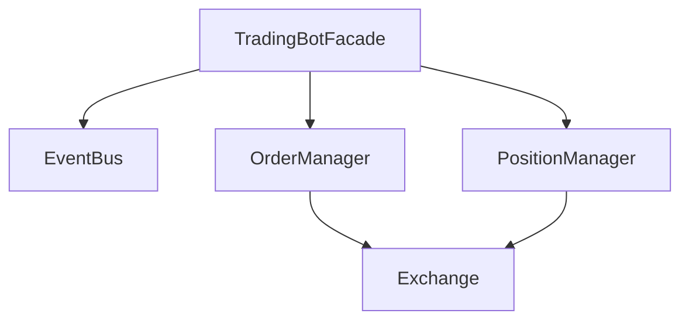

# Repository Improvement Roadmap

This document outlines actionable improvements to make your repository even more impressive for quant job applications.

## 🎯 Priority 1: High Impact, Low Effort

### 1. Dynamic Badges (30 min)
**Current**: Static badges in README  
**Improvement**: Add dynamic badges from GitHub Actions and Codecov

**Action**:
```markdown


```

**Files to update**:
- `README.md` - Replace static badges with dynamic ones

### 2. Add CHANGELOG.md (1 hour)
**Why**: Shows project evolution and version history

**Action**: Create `CHANGELOG.md` following [Keep a Changelog](https://keepachangelog.com/) format

**Content**:
- Version history
- Feature additions
- Bug fixes
- Breaking changes

### 3. Performance Metrics Section (2 hours)
**Why**: Quant employers want to see actual results

**Action**: Add a "Performance" section to README with:
- Backtest results (CAGR, Sharpe, MDD)
- Strategy comparison table
- Sample equity curve image
- Risk metrics

**Files to create**:
- `docs/performance.md` - Detailed performance analysis
- Update `README.md` with performance highlights

### 4. Architecture Diagrams (2 hours)
**Why**: Visual documentation is more engaging

**Action**: 
- Convert text diagrams to Mermaid diagrams
- Add sequence diagrams for key workflows
- Add component diagrams

**Files to update**:
- `docs/architecture.md` - Add Mermaid diagrams
- `README.md` - Add architecture diagram preview

**Example**:


## 🎯 Priority 2: Medium Impact, Medium Effort

### 5. Comprehensive Examples Directory (3-4 hours)
**Why**: Shows practical usage and different use cases

**Action**: Create `examples/` directory with:
- `basic_backtest.py` - Simple backtest example
- `custom_strategy.py` - Strategy customization example
- `live_trading.py` - Live trading setup example
- `performance_analysis.py` - Performance analysis example
- `strategy_comparison.py` - Compare multiple strategies

**Structure**:
```
examples/
├── README.md
├── basic_backtest.py
├── custom_strategy.py
├── live_trading.py
├── performance_analysis.py
└── strategy_comparison.py
```

### 6. API Documentation (4-5 hours)
**Why**: Professional projects have comprehensive API docs

**Action**: 
- Use Sphinx or MkDocs to generate API docs
- Add docstring examples
- Include usage patterns

**Tools**:
- Sphinx with autodoc
- Or MkDocs with mkdocstrings

**Files to create**:
- `docs/api/` - Expand API documentation
- `docs/conf.py` - Sphinx configuration (if using Sphinx)

### 7. Troubleshooting Guide (2 hours)
**Why**: Shows you think about user experience

**Action**: Create `docs/guides/troubleshooting.md` with:
- Common errors and solutions
- Configuration issues
- Performance optimization tips
- Debugging strategies

### 8. Comparison Table (1 hour)
**Why**: Shows why your system is better

**Action**: Add comparison section to README:
- vs. other trading frameworks
- vs. manual trading
- Key differentiators

## 🎯 Priority 3: High Impact, High Effort

### 9. Video Demo / Screenshots (4-6 hours)
**Why**: Visual demonstrations are powerful

**Action**:
- Record a short demo video (2-3 min)
- Add screenshots of:
  - Backtest results
  - CLI usage
  - Performance charts
  - Dashboard (if applicable)

**Files to create**:
- `docs/demo/` - Screenshots and videos
- Update README with media

### 10. Benchmark Suite (6-8 hours)
**Why**: Shows performance characteristics

**Action**: Create `benchmarks/` directory with:
- Performance benchmarks
- Memory usage tests
- Speed comparisons
- Scalability tests

**Files to create**:
- `benchmarks/README.md`
- `benchmarks/performance.py`
- `benchmarks/memory.py`

### 11. Strategy Showcase (4-5 hours)
**Why**: Demonstrates strategy flexibility

**Action**: Create `docs/strategies/` with:
- Strategy comparison
- Parameter sensitivity analysis
- Risk-return profiles
- Market regime analysis

### 12. Research/Paper Section (Optional, 8+ hours)
**Why**: Shows deep understanding

**Action**: Create `docs/research/` with:
- Strategy rationale
- Backtesting methodology
- Risk management approach
- Performance attribution

## 🎯 Priority 4: Polish & Professionalism

### 13. Contributor Guidelines Enhancement (1 hour)
**Why**: Shows you welcome contributions

**Action**: Enhance `CONTRIBUTING.md` with:
- Code style examples
- PR template link
- Review process
- Recognition section

### 14. Roadmap (1 hour)
**Why**: Shows future vision

**Action**: Create `ROADMAP.md` with:
- Short-term goals (3 months)
- Medium-term goals (6 months)
- Long-term vision (1 year)
- Feature requests tracking

### 15. FAQ Section (2 hours)
**Why**: Addresses common questions

**Action**: Add FAQ to README or create `docs/faq.md`:
- Common questions
- Strategy questions
- Technical questions
- Deployment questions

### 16. Blog Post / Article (Optional, 4+ hours)
**Why**: Demonstrates communication skills

**Action**: Write a technical blog post about:
- Strategy development process
- Architecture decisions
- Performance optimization
- Lessons learned

**Platforms**: Medium, Dev.to, personal blog

## 📊 Quick Wins Checklist

### This Week (High Priority)
- [ ] Add dynamic badges to README
- [ ] Create CHANGELOG.md
- [ ] Add performance metrics section
- [ ] Create basic examples directory

### This Month (Medium Priority)
- [ ] Add architecture diagrams (Mermaid)
- [ ] Expand API documentation
- [ ] Create troubleshooting guide
- [ ] Add comparison table

### Next Quarter (Long-term)
- [ ] Video demo / screenshots
- [ ] Benchmark suite
- [ ] Strategy showcase
- [ ] Research documentation

## 🎨 Visual Improvements

### Screenshots to Add
1. **Backtest Results**: Equity curve, drawdown chart
2. **CLI Usage**: Terminal output showing commands
3. **Performance Dashboard**: If you have one
4. **Architecture Diagram**: Visual system overview

### Diagrams to Create
1. **System Architecture**: High-level component diagram
2. **Data Flow**: How data moves through the system
3. **Strategy Flow**: Entry/exit decision process
4. **Deployment Architecture**: Cloud deployment diagram

## 📈 Metrics to Highlight

### Performance Metrics
- CAGR (Compound Annual Growth Rate)
- Sharpe Ratio
- Maximum Drawdown (MDD)
- Win Rate
- Profit Factor
- Average Trade Duration

### Code Quality Metrics
- Test Coverage (90%+)
- Code Complexity
- Documentation Coverage
- Type Coverage (MyPy)

### Project Metrics
- Lines of Code
- Number of Tests
- Documentation Pages
- Contributors (if applicable)

## 🔗 External Links to Add

1. **Live Demo** (if applicable): Deployed version
2. **Documentation Site**: GitHub Pages or ReadTheDocs
3. **CI/CD Status**: GitHub Actions badges
4. **Code Quality**: CodeClimate, SonarCloud
5. **Coverage**: Codecov badge

## 💡 Pro Tips

1. **Quantitative Focus**: Emphasize metrics, backtesting, risk management
2. **Professional Tone**: Use formal language, cite sources
3. **Visual Appeal**: Use diagrams, charts, screenshots
4. **Technical Depth**: Show understanding of trading, Python, architecture
5. **Results-Oriented**: Lead with performance, not features

## 📝 Documentation Template

For each major feature, include:
- **What**: What it does
- **Why**: Why it's important
- **How**: How to use it
- **Example**: Code example
- **Performance**: Performance characteristics
- **Trade-offs**: Design decisions

## 🎯 Success Metrics

Your repository is "portfolio-ready" when:
- ✅ README is engaging and comprehensive
- ✅ Documentation is complete and clear
- ✅ Examples are practical and working
- ✅ Performance metrics are impressive
- ✅ Code quality is high (90%+ coverage)
- ✅ Visual elements are professional
- ✅ CI/CD is set up and passing
- ✅ Badges show current status

---

**Estimated Total Time**: 30-40 hours for all improvements
**Recommended Timeline**: 2-3 months for comprehensive improvements
**Quick Wins**: 5-8 hours for immediate impact
